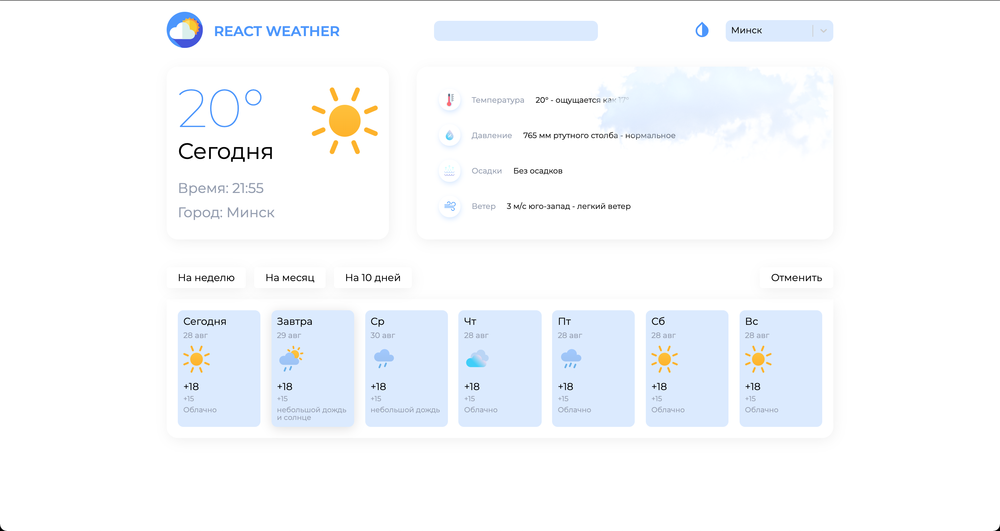
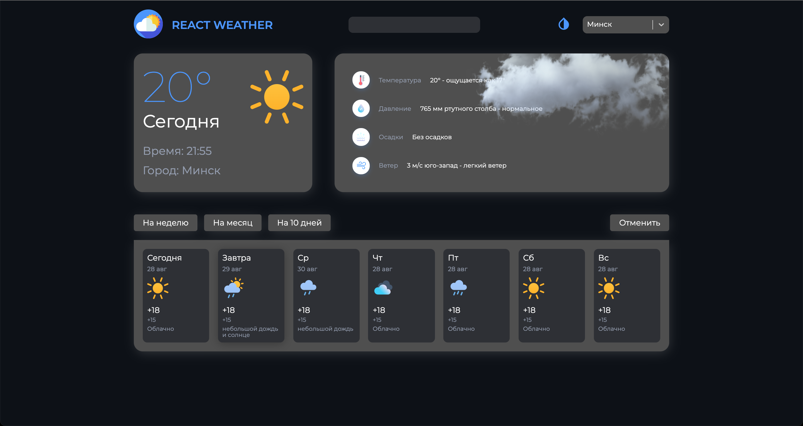

### Приложение Погоды на typescript

> На этапе разработки

### API

- Method: `GET`
- URL" `https://openweathermap.org/api`

### Libraries used

- `module.scss`
- `react-router-dom`
- `react-js`
- `react-select`

---

